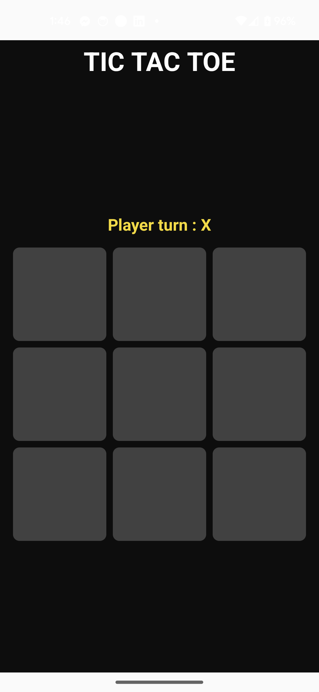
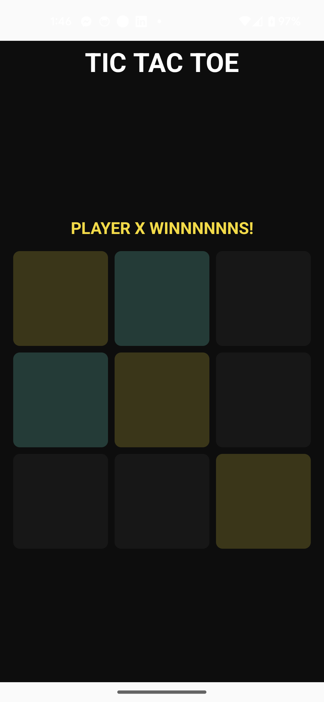
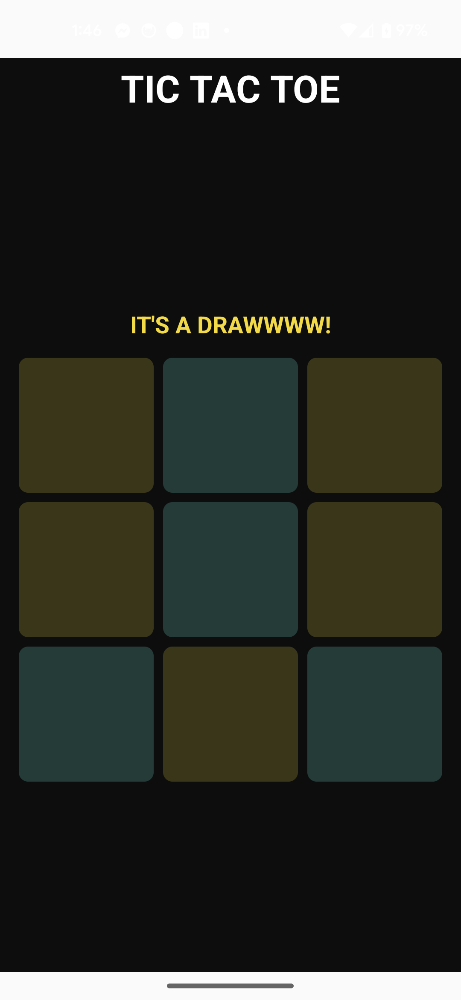

# TIC TAC TOE

# RULES
- X always goes first.
- Players cannot play on a played position.
- Players alternate placing X’s and O’s on the board until either:
    - One player has three in a row, horizontally, vertically or diagonally
    - All nine squares are filled.
- If a player is able to draw three X’s or three O’s in a row, that player wins.
- If all nine squares are filled and neither player has three in a row, the game is a draw.

# OUTPUT

## SCREENSHOTS
|                   |                   |                   |
|-------------------|-------------------|-------------------|
|  |  |  |

## APK
Here is a URL for a quick test: [APK](./res/app-debug.apk)

## TESTS
This is the class that handles the tests:
https://github.com/2023-DEV2-034/MyTest/blob/main/feature/game/src/test/java/dev/test/game/GameViewModelTest.kt

## THOUGHT PROCESS
As TDD was required, I had to think about the test cases before starting the implementation and making technical decisions:
| TEST CASE | EXPECTED OUTCOME |
|--|--|
| Check that the UI on start has an empty board. | All cells in the board should be empty. |
| Check that the UI on start sets "X" as the current player. | The current player in UI should be "X". |
| Check that the UI on start shows the game status as in progress. | The game status should be "In Progress" on start. |
| Check that a move is successful when a cell is empty. | The cell is updated with the current player's symbol. |
| Check that a move is ignored if a cell is already occupied. | UI remains unchanged. |
| Check that that a move is ignored if the game has ended (either by win or draw). | UI remains unchanged. |
| Check that the current player switches to "O" after "X" makes a valid move. | The current player should switch to "O". |
| Check that the current player switches back to "X" after "O" makes a valid move. | The current player should switch to "X". |
| Check that "X" wins by completing a row (horizontally, vertically or diagonally). | "X" should be set as a winner in UI. |
| Check that "O" wins by completing a row (horizontally, vertically or diagonally). | "O" should be set as a winner in UI. |
| Check that the game ends in a draw when all cells are filled without any player winning. | UI should show a draw. |
etc.

Now that I have enough tests to be judged. I proceeded to use MVI (a basic implem) for many reasons, but mainly, for the fact that it allows us have a UI state as a single source of truth, which is very friendly with Jetpack compose and TDD. In a way, we are also testing the UI.

So, you'll see in the commits how I start dealing with tests one by one. First, I write a failing test (\[FAIL\]) and then I fix it in the commit right after (\[PASS\]). After that, you might find some clean up and refactor commits as I am trying to improve the verbosity of the code. All in all, I am following the RED GREEN REFACTOR approach.

You'll also see a how the same test might have failed twice. First for a compilation error, and then for an assertion error. With this, I just wanted to show my understanding of TDD as Uncle Bob recommends it, but in a real world scenario, I might still finish writing the failing tests as I might know how the final implementation might look like.

To summarize, I respected the 3 rules of TDD, plus I made sure, to keep the tests specific and the implementation generic.

As for the modules, we have the following: "App", ":feature:game", "core:design-system".

### Possible improvements
- Finish the tests as I tested the winning conditions only for the top row, the left column and the main diagonal, and it's just for player "X". I didn't want to spend more time on this as there is enough to judge my approach.
- Add more tests.
- More KDoc.
- In the UI state class, it's more appropriate to have the currentPlayer contained in the GameStatus.InProgress class.
- This is important and it's mocking the initial state of the tests to isolate the tested actions.

Now is this the best code I can provide? It's a big NO as this test doesn't allow me to showcase what I know in terms of clean architecture principles and atomic design, I am a big believer in code quality. Hopefully, my humble implementation would meet your standards, and I would get to discuss the test with you in detail.
I am also curious about how you deal with UI tests in TDD.

Thank you. It was fun!
